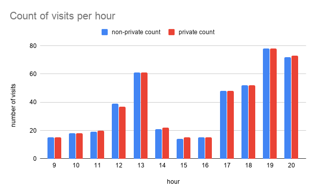
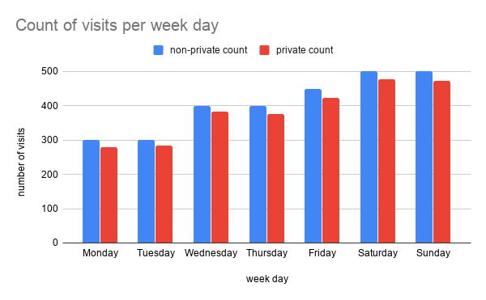
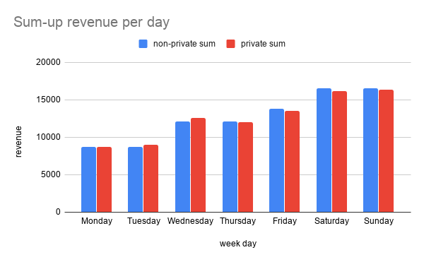
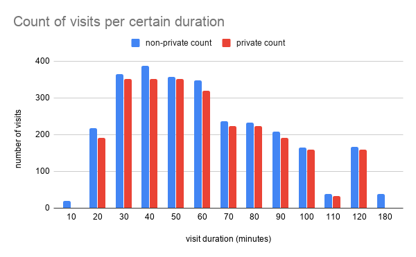
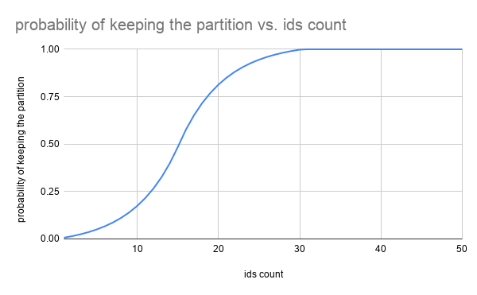

# Example using the Go Differential Privacy Library

## Restaurant

Imagine a fictional restaurant owner named Alice who would like to share
business statistics with her visitors. Alice knows when visitors enter the
restaurant and how much time and money they spend there. To ensure that
visitors' privacy is preserved, Alice decides to use this differential privacy
library.

## Count visits by hour of the day

In this example, Alice wants to share information with potential clients in
order to let them know when the restaurant is most busy.

For this, we will count how many visitors enter the restaurant at every hour of
a particular day. For simplicity, assume that a visitor comes to the restaurant
at most once a day. Thus, each visitor may only be present at most once in the
whole dataset, since the dataset represents a single day of restaurant visits.

The `data/day_data.csv` file contains visit data for a single day. It
includes the visitor’s ID, a timestamp of when the visitor entered the
restaurant, the duration of the visitor's visit to the restaurant (in minutes),
and the money the visitor spent at the restaurant.

Navigate to `examples/go` folder, build the codelab code and run it with the
`scenario=scenario=CountVisitsPerHour` argument.

Linux
```shell
$ cd examples/go
$ bazel run main/examples -- --scenario=CountVisitsPerHour --input_file=$(pwd)/data/day_data.csv --non_private_output_file=$(pwd)/non_private.csv --private_output_file=$(pwd)/private.csv
```

Windows
```shell
$ cd examples/go
$ bazel run main/examples -- --scenario=CountVisitsPerHour --input_file=%CD%/data/day_data.csv --non_private_output_file=%CD%/non_private.csv --private_output_file=%CD%/private.csv
```

This triggers the logic of `CountVisitsPerHourScenario`. It reads the
daily statistics and calculates the number of visitors that entered the
restaurant every hour of the day. The calculation is done twice, for
illustrative purposes:

*   First, `CountVisitsPerHourScenario` computes the raw counts and outputs them
    to the file from the argument `non_private_output_file=<file_name>`.
*   Next, `CountVisitsPerHourScenario` calculates private (i.e., anonymized)
    counts using this differential privacy library and prints them to the file
    from the argument `private_output_file=<file_name>`.

The image below illustrates the results. The blue (left) bars represent the
counts without anonymization while red (right) bars correspond to the private
(or *anonymized*) counts. Notice that the private counts slightly differ
from the non-private counts, though the overall trend is preserved: the
restaurant is more busy during lunch and dinner time.



Note that differential privacy involves adding *random noise* to the actual
data and hence, your own results will most likely be slightly different.

## Partitions and contributions

We say that the resulting aggregated data is split into *partitions*. The bar
chart for the private and non-private counts each have 15 partitions: one for
each hour the restaurant was visited.

More generally, a single partition represents a subset of aggregated data
corresponding to a given value of the aggregation criterion. Graphically, a
single partition is represented as a bar on the aggregated bar chart.

We say that a visitor *contributes* to a given partition if their data matches
the partition criterion. For example, if a visitor enters between 8 AM and 9 AM,
they contribute to the 8 AM partition.

Recall that in the example above, a visitor can enter the restaurant only
once per day. This implies the following three *contribution bounds*.

*   **Maximum partitions contributed**: To how many separate partitions can a
visitor contribute? In our example, a visitor can contribute to, at most, only
one partition. In other words, there is at most one time-slot when a visitor
with a given ID can enter the restaurant.
*   **Maximum contributed value**: What is the maximum value that can be
contributed by a visitor to a partition? In our example, the value is the number
of visits, so the maximum contributed value is simply *1*.
*   **Maximum contributions per partition**: How many times can a visitor
contribute to a partition? In our example, a visitor can contribute to a
partition at most once. In other words, a visitor can enter the restaurant only
once at a given hour.

Why is this important? Differential privacy adjusts the amount of noise to mask
the contributions of each visitor. More contributions require more noise.

Next, we will demonstrate how to use the library in scenarios where:

*   visitors can contribute to multiple partitions;
*   contributed values can be greater than *1*; and
*   visitors can contribute to a partition multiple times.

## Count visits by day of the week

The previous example made some over-simplifying assumptions. Now, let’s have a
look at the use-case where visitors can contribute to multiple partitions.

Imagine Alice decides to let visitors know what the busiest *days* at her
restaurant are. For this, she calculates how many people visit the restaurant
every day of the week. For simplicity, let’s assume a visitor enters the
restaurant at most once a day but may enter multiple days in a single week.

The file `data/week_data.csv` contains visit data for a week.
It includes the visitor’s ID, the visit duration (in minutes),
the money spent at the restaurant, and the day of the visit.

Navigate to `examples/go` folder, build the codelab code and run it with the
`scenario=CountVisitsPerDay` argument.

Linux
```shell
$ cd examples/go
$ bazel run main/examples -- --scenario=CountVisitsPerDay --input_file=$(pwd)/data/week_data.csv --non_private_output_file=$(pwd)/non_private.csv --private_output_file=$(pwd)/private.csv
```

Windows
```shell
$ cd examples/go
$ bazel run main/examples -- --scenario=CountVisitsPerDay --input_file=%CD%/data/week_data.csv --non_private_output_file=%CD%/non_private.csv --private_output_file=%CD%/private.csv
```

This triggers the logic of `CountVisitsPerDayScenario`. It calculates
the number of visitors that entered the restaurant for each day of the week. The
calculation is done twice, for illustrative purposes:

*   First, `CountVisitsPerDayScenario` computes raw counts and outputs them to
    the file from the argument `non_private_output_file=<file_name>`.
*   Next, `CountVisitsPerDayScenario` calculates private (i.e., anonymized)
    count using this differential privacy library and prints them to the file
    from the argument `private_output_file=<file_name>`.

The results are illustrated in the image below.



Notice that the private values slightly differ from the actual ones, though the
overall trend is preserved.

Now, let’s take a closer look at the technical details. Speaking in terms of
*partitions* and *contributions*, the resulting bar chart has 7 partitions; one
for each day of the week. A visitor may enter the restaurant once a day and
hence contribute to a partition at most once. A visitor may enter the restaurant
several times a week and hence contribute to up to 7 partitions. The code below
uses `dpagg.Count` to calculate the differentially private count of visits for a
single day.

```go
const (
    // An upper limit of visits per week for a single person. Visits over this
    // limit will be dropped and ignored in the final statistics.
    //
    // Higher values result into less visits being dropped (and therefore less
    // bias) at the cost of higher noise. A good value should estimate how many
    // times a typical visitor may enter the restaurant per week. Getting
    // this right helps adding optimal amount of noise without losing too much
    // data.
    maxThreeVisitsPerWeek = 3
)

for _, day := range weekDays {
    // Construct dpagg.Count objects, which will be used to calculate DP counts.
    // One Count is created for every work hour.
    dayToDpCount[day], err = dpagg.NewCount(&dpagg.CountOptions{
        Epsilon: ln3,
        // The data was pre-processed so that
        // each visitor may visit the restaurant up to maxThreeVisitsPerWeek times per week.
        // Hence, each visitor may contribute to up to maxThreeVisitsPerWeek daily counts.
        // Note: while the library accepts this limit as a configurable parameter,
        // it doesn't pre-process the data to ensure this limit is respected.
        // It is responsibility of the caller to ensure the data passed to the library
        // is capped for getting the correct privacy guarantee.
        // TODO: Clarify the note above.
        MaxPartitionsContributed: maxThreeVisitsPerWeek,
        Noise:                    noise.Laplace(),
    })
    if err != nil {
        // Handle errors
    }
}

// Pre-process the data set by limiting the number of visits to
// maxThreeVisitsPerWeek per VisitorID.
boundedVisits := boundVisits(weekVisits, maxThreeVisitsPerWeek)
for _, visit := range boundedVisits {
    day := visit.Day
    dayToDpCount[day].Increment()
}

// Run dpagg.Count to calculate a differentially private result
for day, dpCount := range dayToDpCount {
    privateCounts[day], err = dpCount.Result()
    if err != nil {
        // Handle errors
    }
}
```

### Bounding the number of contributed partitions

The parameter `MaxPartitionsContributed` defines the maximum number of
partitions to which a visitor may contribute. One may notice that the value of
`MaxPartitionsContributed` in our example is 3 instead of 7.

Why is that? Differential privacy adds some amount of random noise to hide
the contributions of an individual. The more contributions an individual may
have, the larger the noise must be. This affects the utility of the data. In
order to preserve the data's utility, we made an approximate estimate of how
many times a week a person may visit a restaurant on average, and assumed that
the value is around 3 instead of scaling the noise by the factor of 7.

We also pre-processed the input data and discarded all exceeding visits. The
pre-processing is done by `boundVisits(....)` in `scenarios.go`. It is important
to keep in mind that the library allows to specify a maximum amount of
contributions, but doesn't validate that it is respected.

## Sum the revenue per day of the week

The previous example demonstrates how the contributed partitions are bounded.
Now, we will demonstrate how individual contributions are clamped. Imagine Alice
decides to calculate the sum of the restaurant's revenue per weekday in a
differentially private way. For this, she needs to sum the visitors’ daily
spending at the restaurant. For simplicity, let’s assume a visitor enters the
restaurant at most once a day but may enter multiple times a week (on different
days).

The `data/week_data.csv` file contains visit data for a week.
It includes the visitor’s ID, the visit duration (in minutes),
the money spent at the restaurant, and the day of the visit.

Navigate to `examples/go` folder, build the codelab code and run it with the
`scenario=scenario=SumRevenuePerDay` argument.

Linux
```shell
$ cd examples/go
$ bazel run main/examples -- --scenario=SumRevenuePerDayScenario --input_file=$(pwd)/data/week_data.csv --non_private_output_file=$(pwd)/non_private.csv --private_output_file=$(pwd)/private.csv
```

Windows
```shell
$ cd examples/go
$ bazel run main/examples -- --scenario=SumRevenuePerDayScenario --input_file=%CD%/data/week_data.csv --non_private_output_file=%CD%/non_private.csv --private_output_file=%CD%/private.csv
```

This triggers the logic of SumRevenuePerDayScenario. It sums the amount of money
visitors spend at the restaurant on each day of the week. The calculation is
done twice, for illustrative purposes:

*   First,`SumRevenuePerDayScenario` computes raw sums and outputs them to the
    file from the argument `non_private_output_file=<file_name>`.
*   Next, `SumRevenuePerDayScenario` calculates private (i.e., anonymized) sums
    using this differential privacy library and prints them to file from the
    argument `private_output_file=<file_name>`.

The results are illustrated in the image below.



The code below uses `dpagg.BoundedSumInt64` to calculate the differentially
private sums of the visitors' spending for a single day.

```go
const (
    // TODO: Clarify why we're assuming 4 average visits per week, and why we're calling it a max
    // An estimate of how many times on average a visitor may enter the restaurant per week
    maxFourVisitsPerWeek = 4
    minEurosSpent = 0

    // Maximum amount of money we expect a visitor to spend on a single visit.
    // This limit is used to choose the amount of noise required to "mask"
    // participation of a single user. This is required to ensure that
    // differential privacy guarantees hold for all the users in the dataset,
    // including outliers.
    //
    // Higher limits result into less values being "cut-off" (and therefore less
    // bias) at the cost of higher noise.
    maxEurosSpent = 50
)

for _, day := range weekDays {
    // Construct dpagg.BoundedSumInt64 objects which will be used to calculate DP sums.
    // One dpagg.BoundedSumInt64 is created for every day.
    dayToBoundedSum[day], err = dpagg.NewBoundedSumInt64(&dpagg.BoundedSumInt64Options{
        Epsilon: ln3,
        // The data was pre-processed so that
        // each visitor may visit the restaurant up to maxFourVisitsPerWeek times per week.
        // Hence, each visitor may contribute to up to maxFourVisitsPerWeek daily counts.
        // Note: while the library accepts this limit as a configurable parameter,
        // it doesn't pre-process the data to ensure this limit is respected.
        // It is responsibility of the caller to ensure the data passed to the library
        // is capped for getting the correct privacy guarantee.
        // TODO: Clarify the note above.
        MaxPartitionsContributed: maxFourVisitsPerWeek,
        // No need to pre-process the data: BoundedSumInt64 will clamp the input values.
        Lower: minEurosSpent,
        Upper: maxEurosSpent,
        Noise: noise.Laplace(),
    })
    if err != nil {
        // Handle errors
    }
    privateSums[day] = 0
}

// Pre-process the data set by limiting the number of visits to
// maxFourVisitsPerWeek per VisitorID.
boundedVisits := boundVisits(visits, maxFourVisitsPerWeek)
for _, visit := range boundedVisits {
    dayToBoundedSum[visit.Day].Add(visit.EurosSpent)
}

// Calculate DP result.
for day, boundedSum := range dayToBoundedSum {
    privateSums[day], err = boundedSum.Result()
    if err != nil {
        // Handle errors
    }
}
```

### Clamping individual contributions

The usage of `MaxPartitionsContributed` in `dpagg.BoundedSumInt64` is similar to
its usage in `dpagg.Count`, which is explained in the previous example. This
section focuses on the *lower* and *upper* bounds. The parameters `lower` and
`upper` of `dpagg.BoundedSumInt64` define the *contribution caps*. Every input
value will be automatically clamped to the specified bounds. In other words, any
value that is below `lower` will be overriden to become the same as `lower`, and
any value greater than `upper` will be reduced to be the same as `upper`, so
that all values will be within the bounds of `lower` and `upper`. This is needed
for calculating the sensitivity of the aggregation, and to scale the noise that
will be added to the sum accordingly.

### Choosing bounds

The lower and upper bounds affect the utility of the sum in two potentially
opposing ways: reducing the added noise, and preserving the utility. On the one
hand, the added noise is proportional to the maximum of absolute values of the
bounds. Thus, the closer the bounds are to zero, the less noise is added. On the
other hand, setting the lower and upper bound close to zero may mean that the
input values are clamped more aggressively, which can decrease utility as well.

## Count visits by certain duration

We will now demonstrate that just adding noise to raw data might be not enough
to preserve privacy, and that eliminating some partitions completely may be
necessary. This is referred to as *thresholding* or *partition selection*.

Imagine Alice wants to know how much time visitors typically spend at the
restaurant. Durations of visits can vary greatly. A visitor may be at the
restaurant for 31 minutes, while another may stay for a couple of hours. Instead
of considering the exact durations, Alice wants to look at the approximate
durations, where each visit duration is rounded up to the nearest multiple
of 10 minutes. Assume that a visitor may enter the restaurant at most once a
day, multiple times a week.

The `data/outliers_week_data.csv` file contains visit data for a week.
It includes the visitor’s ID, the visit duration (in minutes),
the money spent at the restaurant, and the day of the visit.

Navigate to `examples/go` folder, build the codelab code and run it with the
`scenario=scenario=CountVisitsPerDuration` argument.

Linux
```shell
$ cd examples/go
$ bazel run main/examples -- --scenario=CountVisitsPerDuration --input_file=$(pwd)/data/outliers_week_data.csv --non_private_output_file=$(pwd)/non_private.csv --private_output_file=$(pwd)/private.csv
```

Windows
```shell
$ cd examples/go
$ bazel run main/examples -- --scenario=CountVisitsPerDuration --input_file=%CD%/data/outliers_week_data.csv --non_private_output_file=%CD%/non_private.csv --private_output_file=%CD%/private.csv
```

This triggers the logic of `CountVisitsPerCertainDurationScenario`. It
calculates the number of visitors who spent a certain amount of time (per visit)
during the week. The calculation is done twice, for illustrative purposes:

*   First, `CountVisitsPerCertainDurationScenario` computes raw counts and
    outputs them to the file from the argument
    `non_private_output_file=<file_name>`.
*   Next, `CountVisitsPerCertainDurationScenario` calculates private
    (i.e., anonymized) counts using the differential privacy library and prints
    them to the file from the argument `private_output_file=<file_name>`.

The results are illustrated in the image below.



Similar to the previous examples, private counts slightly differ from the
non-private counts. In addition, some partitions (e.g., 10 minutes and 180
minutes) do not appear in the private statistics. This is because some
partitions are dropped due to thresholding.

Let’s take a closer look at the technical details. Speaking in terms of
*partitions* and *contributions*, the resulting bar-plot for raw counts has 13
partitions and resulting bar-plot for anonymized counts has 11 partitions. Each
partition is a visit duration (i.e., the initial set of partitions consists of
all visit durations which occurred during the week, rounded up to 10 minutes). A
visitor may enter the restaurant at most once a day, multiple times a week. A
visitor may spend approximately the same time in each visit (e.g., a
fixed-duration lunch break), and hence all their visits over the week may
contribute to the same partition.

### Using BoundedSum for count

Even though we want to calculate the count of visit durations, we can't use
`dpagg.Count` for that because it can only be used for calculating count of
distinct visitors, which is not what we want in this case (i.e., we want to include
the fact that the same visitor may be in the restaurant several times a week).
Therefore we should use `dpagg.BoundedSumInt64`.

```go
const (
    // TODO: Clarify why we're assuming 3 average visits per week, and why we're calling it a max
    // An estimate of how many times on average a visitor may enter the
    // restaurant per week
    maxVisitsPerWeek = 4
)

// Pre-process the data set by limiting the number of visits to maxVisitsPerWeek
// per VisitorID.
boundedVisits := boundVisits(weekVisits, maxVisitsPerWeek)

for _, visit := range boundedVisits {
    durationToVisitCount := visitorIDToDurationToVisitCount[visit.VisitorID]
    duration := roundMinutes(visit.MinutesSpent, 10)
    durationToVisitCount[duration]++

    // Recall that each possible visit duration may be represented by a
    // partition. Here, we construct DP PreAggSelectPartition objects for each
    // such duration. PreAggSelectPartition decides whether there are enough
    // visitors in a partition to warrant keeping it, or if there were too few
    // visitors who stayed for that duration, meaning the partition should be
    // dropped.
    //
    // We use epsilon = log(3) / 2 in this example,
    // because we must split epsilon between all the functions that apply
    // differential privacy, which, in this case, is 2 functions:
    // BoundedSumInt64 and PreAggSelectPartition.
    durationToSelectPartition[duration], err = dpagg.NewPreAggSelectPartition(&dpagg.PreAggSelectPartitionOptions{
        Epsilon:                  ln3 / 2,
        Delta:                    0.02,
        MaxPartitionsContributed: maxVisitsPerWeek,
    })
    if err != nil {
        // Handle errors
    }

    // Construct dpagg.BoundedSumInt64 objects, which will be used to calculate DP
    // counts with multiple contributions from a single privacy unit (visitor).
    // One dpagg.BoundedSumInt64 is created for every duration.
    // We use epsilon = log(3) / 2 in this example,
    // because we must split epslion between all the functions that apply differential privacy,
    // which, in this case, is 2 functions: BoundedSumInt64 and PreAggSelectPartition.
    durationToBoundedSum[duration], err = dpagg.NewBoundedSumInt64(&dpagg.BoundedSumInt64Options{
        Epsilon: ln3 / 2,
        MaxPartitionsContributed: maxVisitsPerWeek,
        Lower: 0,
        Upper: maxVisitsPerWeek,
        Noise: noise.Laplace(),
    })
    if err != nil {
        // Handle errors
    }
}

for _, visits := range visitorIDToDurationToVisitCount {
    for duration, totalVisits := range visits {
        durationToBoundedSum[duration].Add(totalVisits)
        // Count distinct visitors for each duration.
        durationToSelectPartition[duration].Increment()
    }
}

// Calculate DP result
for duration, boundedSum := range durationToBoundedSum {
    // Pre-aggregation partition selection.
    // If there are enough visitors within this duration,
    // then it will appear in the result statistics table.
    // Otherwise, the duration's partition is simply dropped and excluded from the result.
    if durationToSelectPartition[duration].ShouldKeepPartition() {
        privateSums[duration], err = boundedSum.Result()
        if err != nil {
            // Handle errors
        }
    }
}
```

### Partition selection

Having too few privacy units (visitors) contributing to a partition, or having
too few results in a partition, can put users' privacy at risk, even after
adding noise to the data. More precisely, if the set of partitions is not known
in advance, the presence of a particular partition in the output can give an
attacker information about the users in the dataset. In order to protect against
such cases, we need to remove these partitions with too few contributions from
the output.

There are 2 approaches for doing this:

*   **Pre-aggregation partition selection**. Drop partitions which do not have
    a sufficient number of contributing privacy units. Note that these
    partitions may still be included in other aggregation functions' results,
    if there are sufficiently many contributing privacy units for that
    aggregation.
*   **Post-aggregation partition selection**. Apply a threshold to the result
    of an aggregation. This can be only used with count and sum aggregations.
    This threshold is independent from the data; it is calculated using given
    DP parameters. After calculating the statistic (either count or sum) for the
    partition, if the statistic value is less than the threshold, then the
    partition will be excluded from the final result.

Note that even though the library has functionality to calculate a *threshold*
and to *select partitions*, these are not enabled by default. Instead, it is
the responsibility of the caller of the library to invoke the provided
functions.

```go
// Calculate DP result
for duration, boundedSum := range durationToBoundedSum {
    // Pre-aggregation partition selection.
    // If there are enough visitors within this duration,
    // then it will appear in the result statistics table.
    // Otherwise, the duration's partition is simply dropped and excluded from the result.
    keepPartition := durationToSelectPartition[duration].ShouldKeepPartition()
    if keepPartition {
        privateSums[duration], err = boundedSum.Result()
        if err != nil {
            // Handle errors
        }
    }
}
```

In this example, we use the *Differentially Private Partition Selection* method
(described in [this paper](https://arxiv.org/pdf/2006.03684.pdf)).
We use the following parameters: epsilon = log(3) / 2, delta = 0.02,
maxPartitionsContributed = 3. The probability of keeping the partition with
these parameters is shown on the following chart:



Notice that the probability of keeping the partitions with >= 30 privacy units
(visitors) is equal to 1 and the probability of keeping partitions with < 30
privacy units is > 0 and < 1. That means that partitions with >= 30 privacy
units will always be kept and other partitions might be either eliminated or
kept. Thus, we can say that 30 privacy units is a hard threshold for keeping
the partition.

Let's have a closer look to the result bars above. Two partitions were
eliminated:

*   The partition with visits that lasted approximately 10 minutes was
    eliminated. There are only 19 visits (from 16 different visitors) with that
    duration. The probability of keeping this partition is around 50% (see the
    chart above). This means that each run of the scenario can eliminate the
    partition or keep it with the same probability. In the bar chart above, we
    see that it was eliminated.

*   The partition visits that lasted approximately 3 hours. Even though there
    are 38 visits, it doesn't pass the hard threshold, because these visits are
    from the same 5 people who went to the restaurant every day. Therefore,
    there are not enough 3-hour visitors to protect their privacy and we should
    not include their data in the report (i.e., the probability of keeping that
    partition is too small, see the chart above).

Another interesting observation is that there are 35 visits with duration of 110
minutes. Looking at the dataset, it can be seen that they are all from different
visitors. The probability of keeping a partition with 35 privacy units (visitors)
is equal to 1 (see the chart above), which is why it isn’t eliminated.
