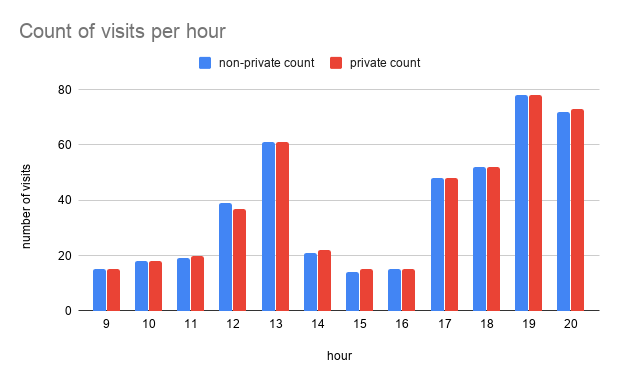
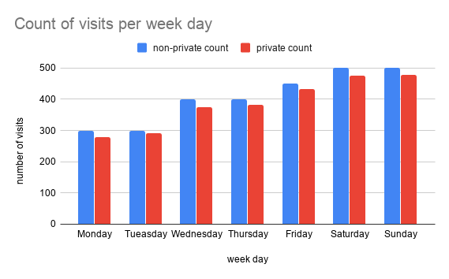
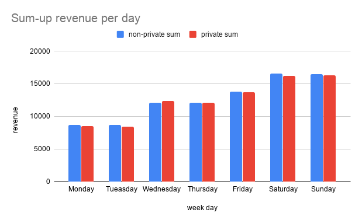
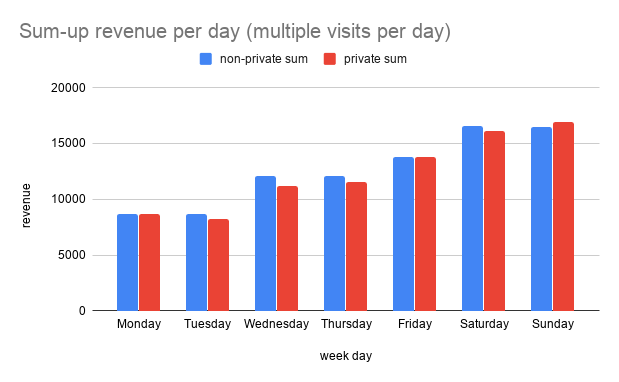

# Example using the Java Differential Privacy Library

## Restaurant

Imagine a fictional restaurant owner named Alice who would like to share
business statistics with her visitors. Alice knows when visitors enter the
restaurant and how much time and money they spend there. To ensure that
visitors' privacy is preserved, Alice decides to use the Differential Privacy
library.

## Count visits by hour of day

In this example Alice wants to share this information with potential clients in
order to let them know the busiest times in the restaurant. For this, we will
count how many visitors enter the restaurant at every hour of a particular day.
For simplicity, assume that a visitor comes to the restaurant at most once a
day. In other words, a visitor is present at most once in the whole dataset.

Visit data for a single day is stored in the `day_data.csv` file. It includes
the visitor’s ID, the visit duration (in minutes), and the money spent at the
restaurant.

Navigate to `examples/java` folder, build the codelab code and run it with the
`COUNT_VISITS_PER_HOUR` argument.

```shell
$ cd examples/java
$ bazel build ...
$ bazel-bin/Main COUNT_VISITS_PER_HOUR
```

This triggers the logic of `CountVisitsPerHour`. It reads the daily statistics
and calculates the number of visitors that entered the restaurant every hour of
the day. The calculation is done twice.

*   First, `CountVisitsPerHour` computes the raw counts and outputs them to
    `non_private_counts_per_hour.csv`.
*   Next, `CountVisitsPerHour` calculates private (anonymized) counts using the
    Differential Privacy library and prints them to
    `private_counts_per_hour.csv`.

The image below illustrates the results. The blue (left) bars represent the
counts without anonymization while red (right) bars correspond to the private
(or *anonymized*) counts. You can see that the private values slightly differ
from the actual ones but the overall trend is preserved. For example, you can
clearly see that the restaurant is more busy during lunch and dinner time.



Note that Differential Privacy involves adding *random noise* to the actual
data, so your results will most likely be slightly different.

## Partitions and contributions

We say that the resulting aggregated data is split into *partitions*. The bar
chart for the private and non-private counts each have 15 partitions, one for
each entry hour.

More generally, a single partition represents a subset of aggregated data
corresponding to a given value of the aggregation criterion. Graphically, a
single partition is represented as a bar on the aggregated bar chart.

We say that a visitor *contributes* to a given partition if their data matches
the partition criterion. For example, if a visitor enters between 8 AM and 9 AM,
they *contribute* to the *8 AM partition*.

Recall that in the the example above, a visitor can enter the restaurant only
once per day. This implies three *contribution bounds*:

*   *Maximum partitions contributed*: to how many partitions can a visitor
    contribute? In our example, a visitor can contribute up to one partition. In
    other words, there is at most one time-slot when a visitor with a given id
    can enter the restaurant.
*   *Maximum contributed value*: what is the maximum value that can be
    contributed by a visitor to a partition? In our example, we count the number
    of visits, so the maximum contributed value is simply *1*.
*   *Maximum contributions per partition*: how many times can a visitor
    contribute to a partition? In our example, a visitor can contribute to a
    partition at most once. In other words, a visitor can enter the restaurant
    only once at a given hour.

Why is this important? Differential Privacy adjusts the amount of noise to mask
contributions of each visitor. More contributions require more noise.

Next, we will demonstrate how to use the library in scenarios where:

*   Visitors can contribute to multiple partitions.
*   Contributed values can be greater than *1*.
*   Visitors can contribute to a partition multiple times.

## Count visits by day of week

The previous example made some over-simplifying assumptions. Now, let’s have a
look at the use-case where visitors can contribute to multiple partitions.

Imagine Alice decides to let visitors know which days are the busiest at her
restaurant. For this, she calculates how many people visit the restaurant every
day of the week. For simplicity, let’s assume a visitor enters the restaurant at
most once a day but multiple times a week.

Visit data for a week is stored in the `week_data.csv` file.

Build the codelab code and run it with the `COUNT_VISITS_PER_DAY` argument.

```shell
$ cd examples/java
$ bazel build ...
$ bazel-bin/Main COUNT_VISITS_PER_DAY
```

This triggers the logic of `CountVisitsPerDay`. It calculates the number of
visitors that entered the restaurant for each day of the week. The calculation
is done twice.

*   First, `CountVisitsPerDay` computes raw counts and outputs them to
    `non_private_counts_per_day.csv`.
*   Next, `CountVisitsPerDay` calculates private (anonymized) counts using the
    Differential Privacy library and prints them to
    `private_counts_per_day.csv`.

The results are illustrated in the image below.



As you can see, the private values slightly differ from the actual ones but the
overall trend is preserved.

Now, let’s take a closer look at the technical details. Speaking in terms of
*partitions* and *contributions*, the resulting bar chart has 7 partitions: one
for each day of the week. A visitor may enter the restaurant once a day and
hence contribute to a partition at most once. A visitor may enter the restaurant
several times a week and hence contribute to up to 7 partitions. The code below
uses `Count` to calculate the differentially private count of visits for a
single day.

```java
// An upper bound for the number of days a singe visitor may contribute to is
// set to 3. All exceeding visits will be discarded.
//
// Higher values result into less visits being dropped (and therefore less
// bias) at the cost of higher noise. A good value should estimate an upper
// bound for a typical user. Getting this right helps adding optimal amount of
// noise without losing too much data.
private static final int MAX_CONTRIBUTED_DAYS = 3;

// Default epsilon.
private static final double LN_3 = Math.log(3);

// Construct DP Count.
Count dpCount = Count.builder()
  .epsilon(LN_3)
  // Each visitor may enter the restaurant on up to MAX_CONTRIBUTED_DAYS days
  // per week. Hence, each visitor may contribute up to MAX_CONTRIBUTED_DAYS
  // daily counts.
  .maxPartitionsContributed(MAX_CONTRIBUTED_DAYS)
  .build();
// Run DP Count to calculate a differentially private result.
dpCount.incrementBy(boundedVisits.getVisitsForDay(day).size());
```

### Bounding the number of contributed partitions

The parameter `maxPartitionsContributed` defines the maximum number of
partitions a visitor may contribute to. You might notice that the value of
`maxPartitionsContributed` in our example is 3 instead of 7. Why is that?
Differential Privacy adds some amount of random noise to hide contributions of
an individual. The more contributions an individual has, the larger the noise
is. This affects the utility of the data. In order to preserve the data utility,
we made an approximate estimate of how many times a week a person may visit a
restaurant on average, and assumed that the value is around 3 instead of scaling
the noise by the factor of 7.

We also pre-processed the input data and discarded all exceeding visits. The
preprocessing is done by `CountVisitsPerDay.boundVisits(....)`. It is important
to keep in mind that the library allows you to specify maximum amount of
contributions, but doesn't validate that it is respected.

## Sum-up revenue per day of the week

The previous example demonstrates how the contributed partitions are bounded.
Now, we will demonstrate how individual contributions are clamped. Imagine Alice
decides to calculate the sum of the restaurant revenue per week day in a
differentially private way. For this she needs to sum up the visitors’ daily
spending at the restaurant. For simplicity, let’s assume a visitor enters the
restaurant at most once a day but multiple times a week.

Visit data for a week is stored in the `week_data.csv` file.

Build the codelab code and run it with the `SUM_REVENUE_PER_DAY` argument.

```shell
$ cd examples/java
$ bazel build ...
$ bazel-bin/Main SUM_REVENUE_PER_DAY
```

This triggers the logic of `SumRevenuePerDay.java`. It sums up the amount of
money visitors spend at the restaurant every day of the week. The calculation is
done twice.

*   First, `SumRevenuePerDay` computes raw sums and outputs them to
    `non_private_sum_per_day.csv`.
*   Next, `SumRevenuePerDay` calculates private (anonymized) sums using the
    Differential Privacy library and prints them to `private_sum_per_day.csv`.

The results are illustrated in the image below.



The code below uses `BoundedSum` to calculate the differentially private sums of
the visitors' spendings for a single day.

```java
  // Number of days a visitor may contribute to is limited to 4. All exceeding
  // visits will be discarded.
  private static final int MAX_CONTRIBUTED_DAYS = 4;
  // Minimum amount of money we expect a visitor to spend on a single visit.
  private static final int MIN_EUROS_SPENT = 0;
  // Maximum amount of money we expect a visitor to spend on a single visit.
  private static final int MAX_EUROS_SPENT = 50;
  // Default epsilon.
  private static final double LN_3 = Math.log(3);

  BoundedSum dpSum = BoundedSum.builder()
    .epsilon(LN_3)
    .maxPartitionsContributed(MAX_CONTRIBUTED_DAYS)
    // Set contribution bounds. BoundedSum will clamp input contributions.
    .lower(MIN_EUROS_SPENT)
    .upper(MAX_EUROS_SPENT)
    .build();

  // Add all visitors' spendings for a day.
  for (Visit v : boundedVisits.getVisitsForDay(d)) {
      dpSum.addEntry(v.eurosSpent());
  }
  // Calculate DP result.
  result = dpSum.computeResult();
```

### Clamping individual contributions

The usage of `maxPartitionsContributed` in `BoundedSum` is similar to its usage
in `Count`, which is explained in the previous example. This section focuses on
the *lower* and *upper* bounds. The parameters `lower` and `upper` of
`BoundedSum` define the *contribution caps*. Every input value will be
automatically clamped to the specified bounds. This is needed for calculating
the sensitivity of the aggregation, and to scale the noise that will be added to
the sum accordingly.

**Choosing bounds**.

The lower and upper bounds affect the utility of the sum in two potentially
opposing ways: reducing the added noise, and preserving the utility. On the one
hand, the added noise is proportional to the maximum of the absolute values of
the bounds. Thus, the closer the bounds are to zero, the less noise is added. On
the other hand, setting the lower and upper bound close to zero may mean that
the input values are clamped more aggressively, which can decrease utility as
well.

### Sum-up revenue per week day (multiple visits per day)
The above examples were somewhat simplified: we assumed that a visitor
contributes to each partition at most once. The good news is that the library
also supports multiple contributions per partition and adjusts the algorithms
accordingly.

*Note*: the library does not have access to the privacy unit ids and
hence ensuring the contribution bounds is the responsibility of the caller.

For some aggregation  (e.g., `BoundedMean`) support for multiple contributions
per partition  is as simple as configuring the `maxContributionsPerPartitions`
parameter. However, if contributions have very different ranges, the library can
add much more noise than necessary. For example, assume we calculate
`BoundedSum` of visitors’ daily spendings. A visitor typically enters the
restaurant twice a day and pays 10 euros for breakfast and 50 euros for dinner.
The `lower` and `upper` bounds should be set to 10 and 50 while
`maxContributionsPerPartitions` equals 2. If we let the library calculate the
sensitivity of sum (i.e., how much a single visitor can impact the final
result), this will result in sensitivity of 100 while the actual sensitivity is
60 (the higher the sensitivity is - the more noise is added). In such a case, it
makes sense to pre-aggregate all visits, and provide a single contribution with
adjusted lower and upper bounds (in our example, sum-up 10 and 50 and set the
upper bound to 60).

Hence, for the algorithms where pre-aggregation is feasible (e.g., `BoundedSum`)
`maxContributionsPerPartitions` cannot be configured and is assumed to be equal
to 1. We ask the client to pre-aggregate the input coming from the same privacy
unit, and pass it to the library as a single contribution. The example below
demonstrates the pre-aggregation.

Imagine, a visitor may enter the restaurant several times per day. Visit data
for this example is stored in the week_data_N_visits_per_day.csv file. Build the
codelab code and run it with the `SUM_REVENUE_PER_DAY_WITH_PREAGGREGATION`
argument.

```shell
$ cd examples/java
$ bazel build …
$ bazel-bin/Main SUM_REVENUE_PER_DAY_WITH_PREAGGREGATION
```

This triggers the logic of `SumRevenuePerDayWithPreAggregation.java`. Its logic
is very similar to `SumRevenuePerDay.java` from the previous example. The
non-private and private results are printed to
`non_private_sum_per_day_w_preaggregation.csv` and
`private_sum_per_day_w_preaggregation.csv` correspondingly. The results are
illustrated in the image below.



The code-snippet below pre-aggregates visitor’s daily spendings before passing
data to `BoundedSum`:

```java
// For each visitor, pre-aggregate their spending for the day.
Map<String, Integer> visitorToDaySpending = new HashMap<>();
for (Visit v : boundedVisits.getVisitsForDay(d)) {
  String visitorId = v.visitorId();
  if (visitorToDaySpending.containsKey(visitorId)) {
    int newAmount = visitorToDaySpending.get(visitorId) + v.eurosSpent();
    visitorToDaySpending.put(visitorId, newAmount);
  } else {
    visitorToDaySpending.put(visitorId, v.eurosSpent());
  }
}
```

We also set the `upper` bound of`BoundedSum` to 65 to reflect the approximate
maximum cumulative amount a visitor may spend on breakfast, lunch, and dinner.

```java
private static final int MAX_EUROS_SPENT = 65;
...
BoundedSum dpSum =
    BoundedSum.builder()
        .epsilon(LN_3)
        .maxPartitionsContributed(MAX_CONTRIBUTED_DAYS)
        .lower(MIN_EUROS_SPENT)
        .upper(MAX_EUROS_SPENT)
        .build();
```
