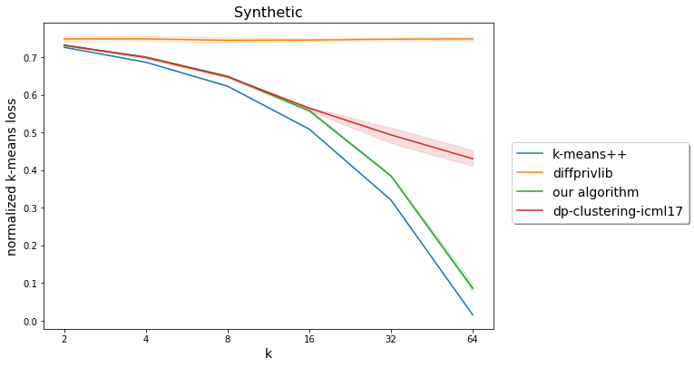
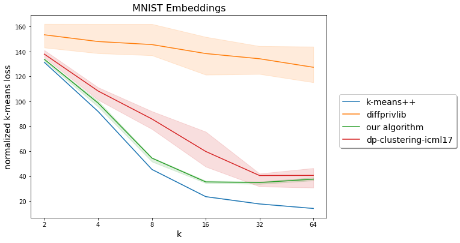
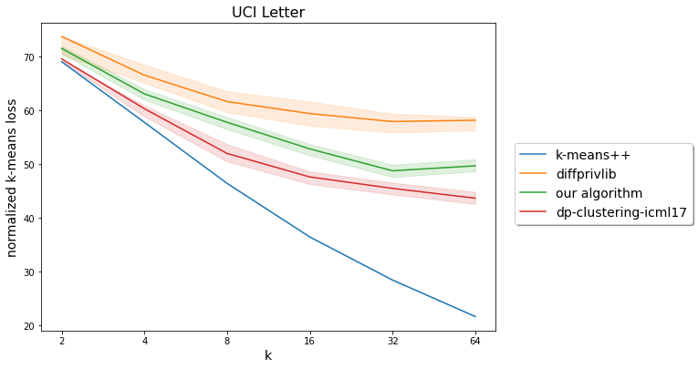
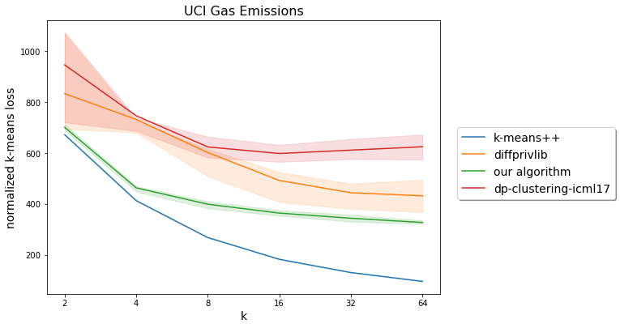

# Differentially Private K-means Clustering (Experimental)

This library provides a differentially private k-means clustering algorithm.
This algorithm uses the central model of differential privacy.

## High-Level Algorithm

The clustering algorithm consists of:

1.  [Tree construction](#tree-construction) using the data and a
    locality-sensitive hash function.

1.  [Private coreset generation](#private-coreset-generation) from the tree to
    produce a weighted private dataset.

1.  Nonprivate k-means on the private coreset to generate `k` private centers.

### Tree Construction

A [prefix tree](https://en.wikipedia.org/wiki/Trie) is generated based on the
hash value of the datapoints. Each node of the tree consists of a `hash_prefix`
and `nonprivate_points` which is the subset of points which hash to the
`hash_prefix`.

Besides the general rules of prefix trees, the rules for generating the tree are
as follows:

*   Node are only branched if the private count of `nonprivate_points` is at
    least `min_num_points_in_branching_node`.

*   Nodes besides the root node are only present in the tree if the private
    count of `nonprivate_points` is at least `min_num_points_in_node`.

*   The maximum depth of the tree is `max_depth`.

The parameters mentioned above are set automatically by the algorithm, but can
be overridden if desired by passing in a custom `clustering_params.TreeParam`.

### Private Coreset Generation

The weighted private coreset consists of a `(coreset_point, coreset_weight)` for
each leaf of the tree:

*   `coreset_point`: differentially private average of the `nonprivate_points`
    of the leaf

*   `coreset_weight`: differentially private count of `nonprivate_points` of the
    leaf

The distribution of noise added during different operations in the clustering
algorithm can be controlled by passing in a custom
`clustering_params.PrivacyCalculatorMultiplier`. This is used by the algorithm's
[mechanism calibration](https://github.com/google/differential-privacy/blob/main/python/dp_accounting/mechanism_calibration.py).
See `clustering_params.PrivacyCalculatorMultiplier` for details.

> **Note:** `clustering_params.PrivacyBudgetSplit` is deprecated. Use
`clustering_params.PrivacyCalculatorMultiplier` instead.

## Usage

The entry point to our algorithm is `clustering.private_lsh_clustering()`.

### Basic Parameters

*   `datapoints`: numpy array where each row is a datapoint. For the current
    iteration of the algorithm, centering this data around the origin beforehand
    may provide performance improvements.

*   `radius`: bound on the distance of each point from the origin in datapoints.

*   `k`: number of clusters to divide the data into.

*   `epsilon`, `delta`: differential privacy parameters.

> **Note:** Additional parameters for fine-tuning are available in
`clustering_params.py`.

### Result

*   `result.centers`: Differentially private cluster centers.

*   `result.labels`: Indices of the closest center for each datapoint. Provided
    for convenience, these are nonprivate.

*   `result.loss`: The k-means objective with respect to the centers, i.e., sum
    of squared distances of the data to their closest center. Provided for
    convenience, this is nonprivate.

### Basic Usage

```python
data = clustering_params.Data(datapoints, radius)
differential_privacy_param = clustering_params.DifferentialPrivacyParam(epsilon, delta)
result: clustering.ClusteringResult = clustering.private_lsh_clustering(k, data, privacy_param)
```

## Demo

`demo/clustering_demo.py` presents sample code for using the clustering library
on a synthetically generated dataset. The clustering algorithm is run several
times (i) for various choices of `k` for a fixed value of `epsilon` and (ii)
for various choices of `epsilon` for a fixed value of `k`. For each run,
the code reports the k-means loss and several clustering quality metrics,
related to how well the clusters reflect the ground truth labels.

> **Note:** Computation of the k-means loss and the clustering quality metrics are
done non-privately, just for the purposes of this demo.

### Synthetic dataset generation

The synthetic dataset is generated by sampling from a mixture of Gaussian
distributions, where each mixture component corresponds to a cluster and each
cluster center is sampled from a uniform distribution in a Euclidean ball
centered at zero. Finally, the points are clipped to a specified radius.

### Running the demo

#### Run with Bazel

For running the example using Bazel, you need to have
[Bazel installed](https://docs.bazel.build/versions/main/install.html).
Once that is done, run the following from the `learning/` directory:

```bash
bazel build clustering:all
bazel run clustering/demo:clustering_demo -- [options]
```

#### Run via setup.py

For the second option, you will need the
[setuptools package](https://pypi.org/project/setuptools/) installed.
To ensure this, you may run

```bash
pip install --upgrade setuptools
```

Then, to demonstrate our example, run the following from the `learning/`
directory:

```bash
python setup.py install
python clustering/demo/clustering_demo.py
```

We test this library on Linux with Python version 3.9. If you experience any
problems, please file an issue on GitHub, also for other platforms or Python
versions.

The following options are available:

*   `num_points`: number of points in synthetic dataset.

*   `dim`: dimension of points in synthetic dataset.

*   `num_clusters`: number of clusters in synthetic dataset.

*   `cluster_ratio`: parameter controlling the ratio of distances between points
    in different vs. same cluster.

*   `radius`: radius of ball in which all points in synthetic dataset lie.

*   `fixed_epsilon`: value of `epsilon` when experimenting with varying `k`.

*   `k_to_try`: list of `k` values to use when experimenting with varying `k`.

*   `fixed_k`: value of `k` when experimenting with varying `epsilon`.

*   `epsilon_to_try`: list of `epsilon` values to use when experimenting with
    varying `epsilon`.

*   `use_mechanism_calibration`: whether to use the experimental mechanism
    calibration for noise parameters.

## Benchmark Comparisons

These benchmarks compare the normalized k-means objective (average squared
distances of the data to their closest center) for this algorithm against the
nonprivate [sklearn KMeans](https://scikit-learn.org/stable/modules/generated/sklearn.cluster.KMeans.html)
and private implementations of
[IBM diffprivlib Kmeans](https://github.com/IBM/differential-privacy-library/tree/0.5.0/diffprivlib)
and the accompanying code for the paper
[Differentially Private Clustering in High-Dimensional Euclidean Spaces](http://proceedings.mlr.press/v70/balcan17a.html)
from ICML 2017
([dp-clustering-icml17](https://github.com/mouwenlong/dp-clustering-icml17/tree/d39f8fd54f088afe0e19d85a6d0462916225f79c)).

For each benchmark dataset we consider, we evaluate each of the above algorithms
for various values of `k` with fixed choice of privacy parameters (`epsilon =
1.0` and `delta = 1e-6`). We run each algorithm 20 times on each dataset. In all
the plots below, the solid curves denote the mean over the 20 runs, and the
shaded region denotes the 25-75 percentile range.

> **Note:** [dp-clustering-icml17](https://github.com/mouwenlong/dp-clustering-icml17/tree/d39f8fd54f088afe0e19d85a6d0462916225f79c)
works in the setting of _pure differential privacy_, namely `delta = 0`. Also,
the privacy parameters are irrelevant for the non-private
[sklearn KMeans](https://scikit-learn.org/stable/modules/generated/sklearn.cluster.KMeans.html).

> **Note:**
[IBM diffprivlib Kmeans](https://github.com/IBM/differential-privacy-library/tree/0.5.0/diffprivlib)
takes in an upper bound on the infinity norm of allowed data points, whereas
[dp-clustering-icml17](https://github.com/mouwenlong/dp-clustering-icml17/tree/d39f8fd54f088afe0e19d85a6d0462916225f79c)
takes in both the radius and the infinity norm. For purposes of benchmarking,
we compute these values exactly (non-privately) for each dataset.

### Synthetic Dataset

We generate a synthetic dataset consisting of 100,000 data points in 100
dimensions sampled from a mixture of 64 Gaussians (with standard deviation
0.0125 per dimension) with centers sampled uniformly in a sphere centered at the
origin with radius 0.875 so that the entire dataset has radius approximately 1;
points falling outside are projected to the sphere. The code for generating this
dataset can be found [here](./demo/data_generation.py).

Plot varying `k` in `[2, 4, 8, 16, 32, 64]` for fixed `epsilon = 1.0` and `delta = 1e-6`\


### Neural Embeddings of MNIST dataset

We use the penultimate layer of a
[convolutional neural network](https://www.tensorflow.org/tutorials/images/cnn)
trained on the images of handwritten digits in the
[MNIST](http://yann.lecun.com/exdb/mnist/) training dataset (consisting of
60,000 points), to generate 40-dimensional embeddings for these images.

Plot varying `k` in `[2, 4, 8, 16, 32, 64]` for fixed `epsilon = 1.0` and
`delta = 1e-6`\


### UCI Letter Recognition Dataset

Dataset on Letter Recognition (from
[UC Irvine repository of datasets](https://archive.ics.uci.edu/ml/datasets/letter+recognition))
contains 20,000 instances of 16 primitive numerical attributes of
black-and-white rectangular pixel displays containing one of the 26 capital
letters in the English alphabet in 20 different fonts (with images randomly
distorted to create unique data points). This dataset was (non-privately)
centered before evaluating the algorithms.

Plot varying `k` in `[2, 4, 8, 16, 32, 64]` for fixed `epsilon = 1.0` and
`delta = 1e-6`\


### UCI Gas Emissions Dataset

Dataset on Gas Turbine CO and NOx Emissions (from
[UC Irvine repository of datasets](https://archive.ics.uci.edu/ml/datasets/Gas+Turbine+CO+and+NOx+Emission+Data+Set))
contains 36,733 instances of 11 sensor measures aggregated over one hour (by
means of average or sum) from a gas turbine, for the purpose of studying flue
gas emissions, namely CO and NOx (NO + NO2). This dataset was (non-privately)
centered before evaluating the algorithms.

Plot varying `k` in `[2, 4, 8, 16, 32, 64]` for fixed `epsilon = 1.0` and
`delta = 1e-6`\

